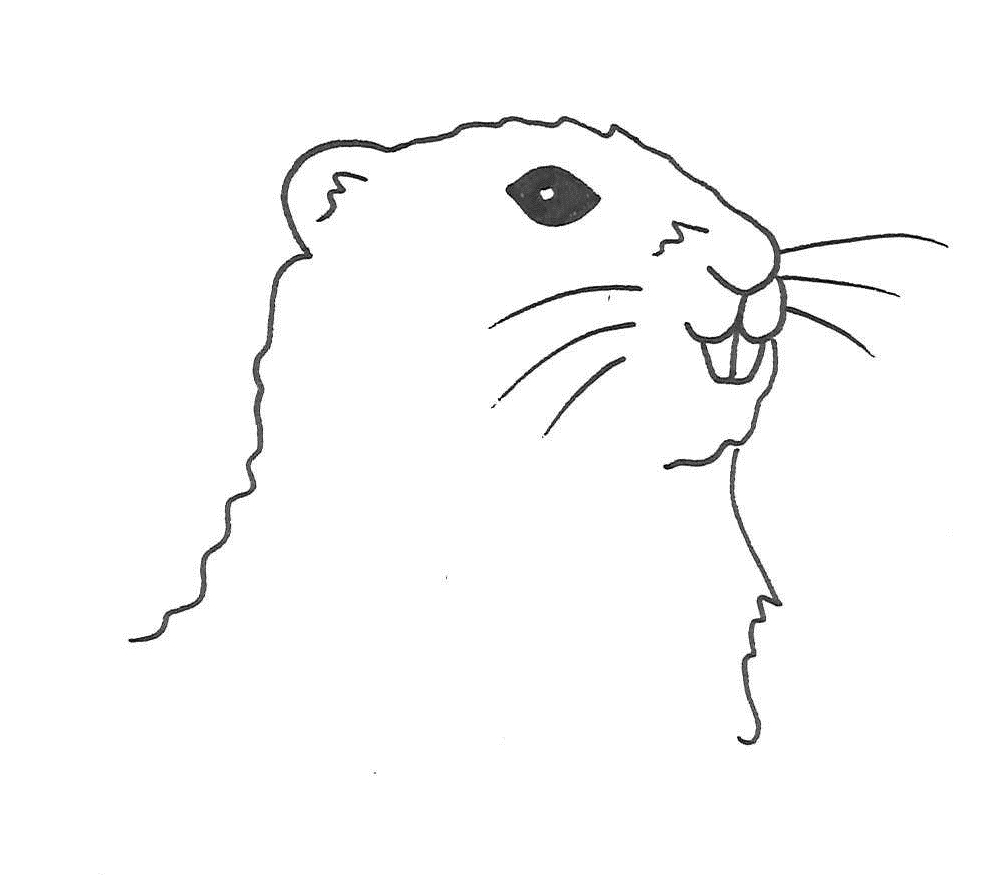

# MARRMoT
Modular Assessment of Rainfall-Runoff Models Toolbox - Matlab code for 47 conceptual hydrologic models.

MARRMoT is a novel rainfall-runoff model comparison framework that allows objective comparison between different conceptual hydrological model structures.
The framework provides Matlab code for 47 unique model structures, standardized parameter ranges across all model structures and robust numerical implementation of each model.
The framework is provided with extensive documentation, a User Manual and several workflow scripts that give examples of how to use the framework.
MARRMoT is based around individual flux functions and aggregated model functions, allowing a wide range of possible applications.

If you have any questions about using or running the code, or are willing to contribute, please contact l.trotter[-at-] unimelb.edu.au or wouter.knoben[-at-]usask.ca

## MARRMoT v2
The MARRMoT master branch has been updated to version 2. Main changes compared to v1 include code refactoring to rely on object-oriented programming. A paper describing these changes will be submitted to Geoscientific Model Development in the near future. Until such time, please be aware that this version of the code has not yet passed peer review.

The last release of MARRMoT v1 is version 1.4 and can be found as a release here: dx.doi.org/10.5281/zenodo.6460624

## Getting Started
These instructions will help you install a copy of MARRMoT and run a few example cases.

### Requirements
MARRMoT has been developed on MATLAB version 9.11.0.1873467 (R2021b) and tested with Octave 6.4.0.
To run in MATLAB, the Optimization Toolbox is required, while Octave requires the "optim" package.

Note that the function `circshift()` that is used by routing routines has markedly different behaviour in Matlab 2016b and higher compared to previous versions. Routing results will be unreliable in Matlab 2016a and below but will **_not_** generate any warnings or error messages. User discretion is advised.

### Install
Download a copy of the files from this repository (note: do not use the folder 'Octave' when using Matlab) and extract the files in an appropriate directory.

### Try an example application
- Open Matlab
- Add the folder 'MARRMoT' and its subfolders 'Functions', 'Models' and 'User Manual' to the Matlab path
- Navigate Matlab's current folder to './MARRMoT/User Manual'
- Open the script 'workflow_example_1.m'
- Run the script by pressing F5
- Repeat with 'workflow_example_2.m' and 'workflow_example_3.m' ('workflow_example_4.m' shows a calibration example and takes a bit longer)

The User Manual provides further details.

## Documentation
The article describing MARRMoT's v2.- update will soon be submitted to the scientific journal 'Geoscientific Model Development'.

MARRMoT's documentation includes:

- **New paper**: object-oriented implementation, changes from MARRMoT v1 to v2, soon to be submitted for peer review.
- **Original paper**: rationale behind MARRMoT development, best practices used during development, summary of included model structures and an example application of all structures to simulate streamflow in a single catchment. https://doi.org/10.5194/gmd-12-2463-2019
- **User manual**: description on how to use MARRMoT v2 and how to contribute to it.
- **User manual appendices**: detailed model descriptions (A), flux equations (B) and unit hydrographs (C)

User manual and appendices are found in this repository in "./MARRMoT/User manual"

## Model structure summary
MARRMoT model structures are based on a wide variety of different models.
However, do to the standardised format of this framework, MARRMoT models resemble, but are not the same as the models they are based on.
In addition to a range of unnamed models, the following models provided inspiration for MARRMoT:

- FLEX-Topo
- IHACRES
- GR4J
- TOPMODEL
- SIMHYD
- VIC
- LASCAM
- TCM
- TANK
- XINANJIANG
- HYMOD
- SACRAMENTO
- MODHYDROLOG
- HBV-96
- MCRM
- SMAR
- NAM
- HYCYMODEL
- GSM-SOCONT
- ECHO
- PRMS
- CLASSIC
- IHM19

## License
MARRMoT is licensed under the GNU GPL v3 license - see the LICENSE file for details.

## DOIs of previous releases
- v1.4: dx.doi.org/10.5281/zenodo.6460624
- v1.3: dx.doi.org/10.5281/zenodo.3552961
- v1.2: dx.doi.org/10.5281/zenodo.3235664
- v1.1: dx.doi.org/10.5281/zenodo.2677728
- v1.0: dx.doi.org/10.5281/zenodo.2482542

## Acknowledgements
MARRMoT could not have been made without the effort that many hydrologists have put into development of their models. Their effors are gratefully acknowledged. Special thanks are extended to:
- Philip Kraft for finding a bug in the flux smoothing code during peer review;
- Sebastian Gnann for suggesting various quality of life fixes;
- Clara Brandes for finding and suggesting a fix for a bug in the water balance calculations and implementing m47;
- Koen Jansen for suggesting various improvements and correcting parameter descriptions;
- Mustafa Kemal Türkeri for making workflow_example_4 operational in Octave; and for performing extensive testing of MARRMoT in Matlab and Octave;
- Thomas Wöhling for suggesting various additional efficiency metrics and a possible implementation for warmup periods.
